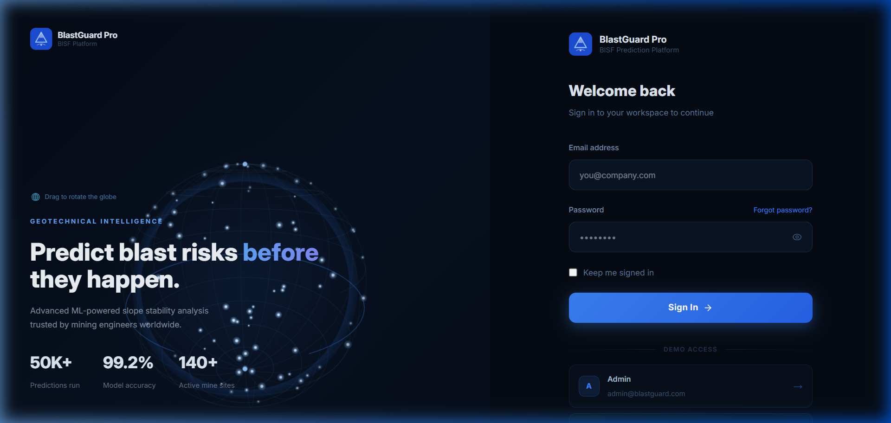
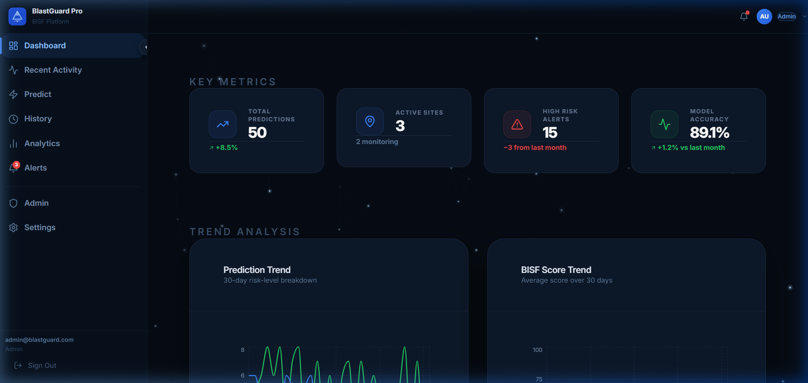
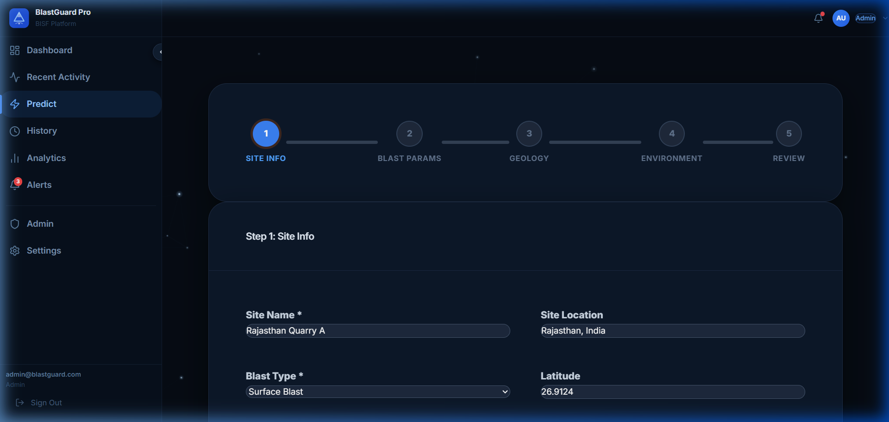
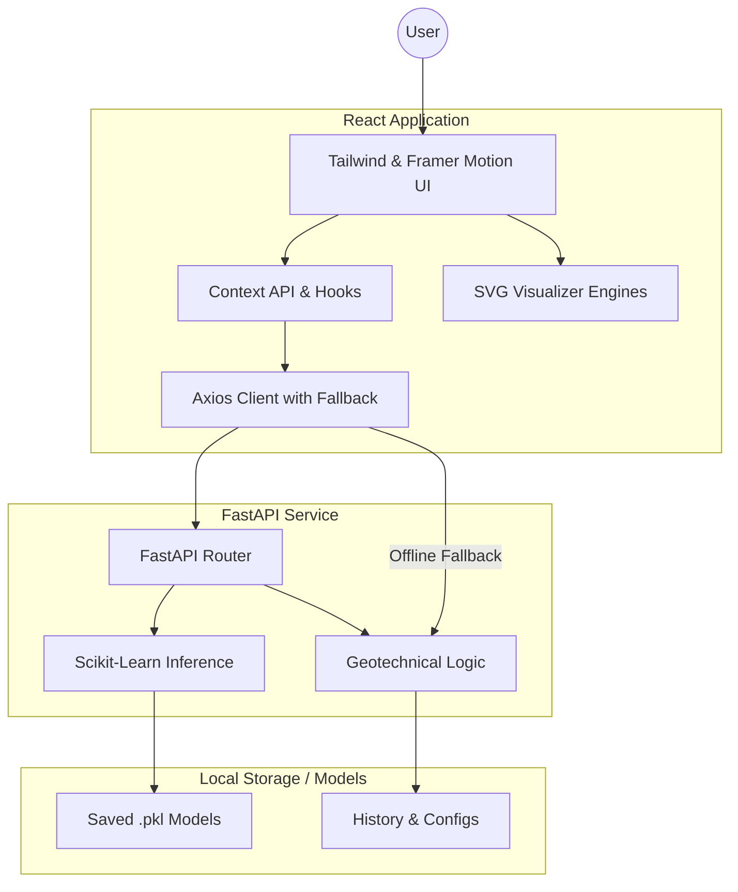

# 🏗️ BlastGuard Pro
### **Blast-Induced Slope Failure (BISF) Prediction & Monitoring Platform**

[](https://reactjs.org/)
[](https://fastapi.tiangolo.com/)
[](https://scikit-learn.org/)
[](https://tailwindcss.com/)

---

## 📖 About the Project

**BlastGuard Pro** is an advanced AI-driven platform designed to tackle one of the most critical challenges in open-pit mining: **Blast-Induced Slope Failure (BISF)**. 

Slope failure in mining environments can lead to catastrophic safety risks and massive economic losses. By integrating real-time geotechnical data with machine learning algorithms, this platform allows engineers to:
- **Analyze** complex rock mass properties and blast designs simultaneously.
- **Predict** the probability of slope instability before any detonation occurs.
- **Visualize** the structural response of the rock through high-fidelity SVG simulations.
- **Optimize** blast parameters (burden, spacing, charge weights) to maintain slope integrity while achieving desired fragmentation.

This tool is built to provide actionable insights where traditional formulas often fall short, enabling a "Safety-First" approach to high-energy mining operations.

---

## 🌐 Live Demo
**[Live Link Coming Soon]**  
*Currently available for local deployment only.*

---

## 📸 Local Preview

### Login & Authentication


### Risk Assessment Dashboard


### Prediction Wizard & Analytics


---

## 🚀 Core Value Proposition

- **Predictive Intelligence**: Leverage Machine Learning to forecast Blast-Induced Slope Failure (BISF) risks before the first hole is drilled.
- **Live Visual Simulations**: Interactive SVG visualizers for blast holes and slope geometry that update in real-time as parameters change.
- **Offline Resilience**: Built-in geotechnical formula engine that automatically takes over if the ML backend is unavailable.
- **Enterprise-Ready**: Role-based access control, comprehensive audit logs, and professional reporting templates.

---

## 🛠️ Technology Stack

| Layer | Technologies |
| :--- | :--- |
| **Frontend** | React 18, Vite, Tailwind CSS, Framer Motion, Recharts |
| **Forms & Validation** | React Hook Form, Zod |
| **State Management** | React Context API (Auth, Theme, Notifications) |
| **Data Visualization** | Custom SVG Engines, Recharts (Analytics) |
| **Backend** | Python 3.9+, FastAPI, Uvicorn |
| **Machine Learning** | Scikit-Learn, Joblib, NumPy, Pandas |

---

## ✨ Key Features

### 📊 Intelligent Dashboard
A high-level command center featuring:
- **KPI Cards**: Instant view of site safety metrics.
- **Dynamic Charts**: 4 real-time charts tracking risk trends and blast performance.
- **Activity Feed**: Live log of site assessments and predictions.
- **Site Status Map**: Interactive visualization of multiple mining sites.

### 🧙‍♂️ 5-Step Prediction Wizard
A streamlined workflow for complex geotechnical assessments:
1. **Geometric Input**: Define burden, spacing, and hole parameters.
2. **Blast Parameters**: Configure charge weight, delays, and specific charge.
3. **Slope Details**: Input slope angle, height, and orientation.
4. **Rock Mass Data**: Define RMR, RQD, and joint characteristics.
5. **Real-time Preview**: See your design update live in the SVG visualizer.

### 🎨 Live Visualizers
- **BlastHoleVisualizer**: Detailed SVG cross-section showing stemming, charge zones, and scatter patterns. Animates energy waves based on predicted risk.
- **SlopeCrossSectionVisualizer**: Structural geometry that reacts to rock type and groundwater levels, showing failure planes for high-risk scenarios.

---

## ⚙️ Installation & Setup

### 1. Prerequisites
- Node.js 18+
- Python 3.9+
- Git

### 2. Frontend Setup
```bash
cd frontend
npm install
npm run dev
# Dashboard available at http://localhost:5173
```

### 3. Backend Setup
```bash
cd backend
pip install -r requirements.txt
# Start the FastAPI server
uvicorn main:app --reload --port 8000
# API documentation available at http://localhost:8000/docs
```

---

## 🧠 ML Model Integration

The platform is designed to be model-agnostic. Place your trained `.pkl` files in `backend/models/`:

- `bisf_classifier.pkl`: Main risk classifier (predicts `bisf_score`).
- `ppv_regressor.pkl`: Predicts Peak Particle Velocity.
- `fragmentation_model.pkl`: Calculates fragmentation index.

**Feature Input Order (19 features):**
`burden, spacing, hole_depth, hole_diameter, stemming_length, total_charge, max_charge_delay, specific_charge, slope_height, slope_angle, number_of_rows, rmr, rqd, joint_orientation, joint_spacing, distance_to_structure, distance_to_slope_crest, rock_type (encoded), groundwater (encoded)`

---

## 🔒 Security & Access

| Role | Permissions |
| :--- | :--- |
| **Admin** | Full system control, user management, API key rotation. |
| **Mining Engineer** | Full prediction workflow, site management. |
| **Geotechnical Analyst** | History analysis, report generation, analytics. |

**Default Admin Credentials:** `admin@blastguard.com` / `admin123`

---

## 🔄 System Architecture



---

## 🏗️ Project Structure

```text
blastguard-pro/
├── frontend/
│   ├── src/
│   │   ├── components/
│   │   │   ├── layout/     # Navigation and Shell
│   │   │   ├── ui/         # Reusable Atomic Components
│   │   │   └── visualizer/ # Custom SVG Engines
│   │   ├── pages/          # 11+ Feature Pages
│   │   └── services/       # API Integration with Fallback Logic
└── backend/
    ├── main.py             # FastAPI Entry Point
    ├── models/             # ML Model Storage
    └── requirements.txt    # Python Dependencies
```

---

## 📄 License & Credits

**Developed with ❤️ by Tanishaa Priya**

*Designed for the Geotechnical Engineering Community.*
